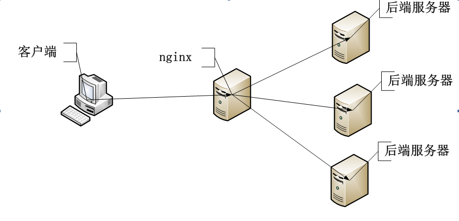

### 介绍

用 PHP 实现几种负载均衡调度算法，详细见 [负载均衡算法](https://www.fanhaobai.com/2018/11/load-balance-round-robin.html) 系列。



### 调度算法

*   [普通轮询（general Round Robin）](https://github.com/Tinywan/load-polling/blob/master/src/Robin.php)
*   [加权轮询（Weighted Round Robin）](https://github.com/Tinywan/load-polling/blob/master/src/WeightedRobin.php)
*   [平滑加权轮询（Smooth Weighted Round Robin）](https://github.com/Tinywan/load-polling/blob/master/src/SmoothWeightedRobin.php)

### Installation  

```composer log
composer require tinywan/load-polling 
```

### Basic Usage  

```PHP
// 服务器数
$services = [
    '192.168.10.1:2202' => 5,
    '192.168.10.2:2202' => 1,
    '192.168.10.3:2202' => 1,
];

// 使用平滑加权算法 (Smooth Weighted Round Robin)
$robin = new SmoothWeightedRobin();
$robin->init($services);

$nodes = [];
for ($i = 1; $i <= 7; $i++) {
    $node = $robin->next();
    $nodes[$i] = $node;
}
var_export($nodes);
```

### 调度结果

使用平滑加权算法 (Smooth Weighted Round Robin)，会生成如下均匀序列：

```Bash
'192.168.10.1:2202'
'192.168.10.1:2202'
'192.168.10.2:2202'
'192.168.10.1:2202'
'192.168.10.3:2202'
'192.168.10.1:2202'
'192.168.10.1:2202'
```

### Composer

安装提示错误：`Could not find package tinywan/load-polling in a version matching 1.0`
尝试改成Packagist的地址 https://packagist.org
```composer log
"repositories": {
    "packagist": {
        "type": "composer",
        "url": "https://packagist.org"
    }
}
```
> 要使你发布的最新包可以使用，请使用以上的镜像源，为了学习